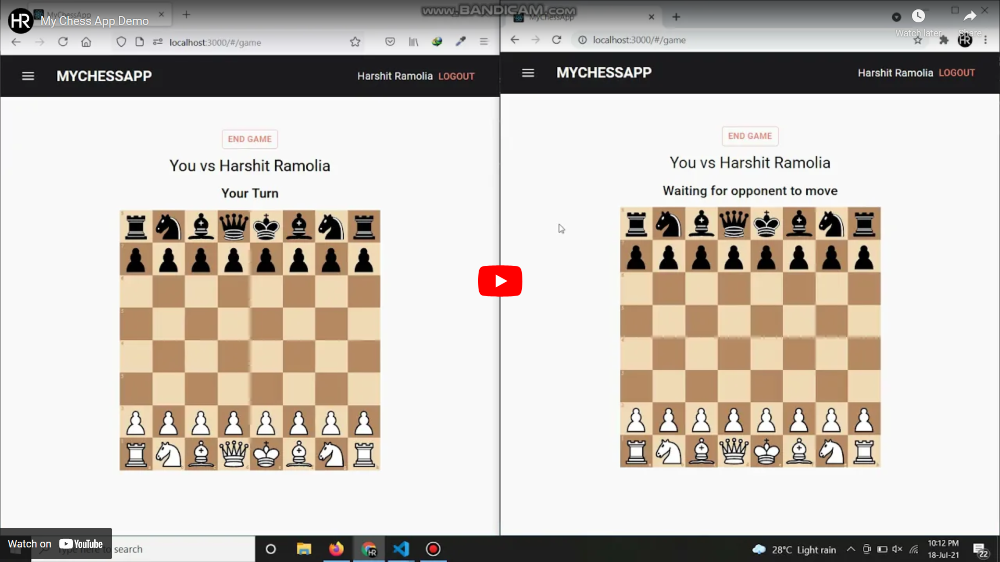

# This is backend repository for Multiplayer Online Chess Game (MERN Stack)

 

Link to frontend repository is https://github.com/Harshit-Ramolia/MyChessApp

Implemented a full stack website using MERN Stack with typescript language and API using typegraphql.

Achieved realtime user experience in gameplay and other features using web socket connection with the help of graphql subscriptions.

Added features like Google signin, inviting friends, and rewatching history of games played by user.